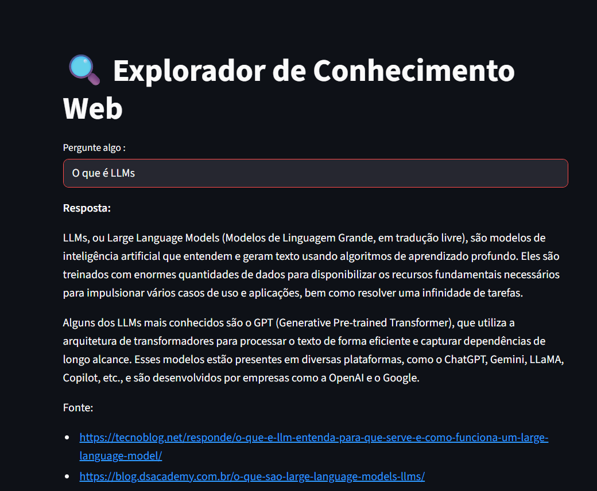

Um aplicativo em Python com Streamlit que permite ao usuário **fazer perguntas em linguagem natural** e receber **respostas baseadas em resultados da web**, utilizando **DuckDuckGo Search** e **Together.ai (modelo Mixtral)** como motor de resposta.



## ✨ Funcionalidades

- 🔎 Busca informações em tempo real na web.
- 💬 Responde com base nos resultados encontrados.
- 🧠 Usa modelo LLM local ou hospedado (Mixtral via API).
- 🇧🇷 Sempre responde em **português**.
- 💻 Interface amigável feita com **Streamlit**.


O Together.ai é uma plataforma de infraestrutura e modelos de linguagem open-source, que oferece acesso a modelos LLM (Large Language Models) de alto desempenho, como:

Mistral 7B, Mixtral-8x7B

LLaMA 2, LLaMA 3

Command R, Falcon, entre outros.

### 1. Clone o repositório

```bash
git clone https://github.com/C-Lemia/LLMs.git
cd LLMs

##### Crie um ambiente virtual
python -m venv venv
venv\Scripts\activate  # No Windows

##### Instale as dependências
pip install -r requirements.txt

##### Configure o .env
Crie um arquivo .env na raiz do projeto com sua chave da Together.ai: https://www.together.ai/
Arquivo .env com : TOGETHER_API_KEY=your_api_key_here

##### Executando o app

streamlit run app.py

# 🛠 Tecnologias

Python 3.10+

Streamlit

DuckDuckGo Search

Together.ai API